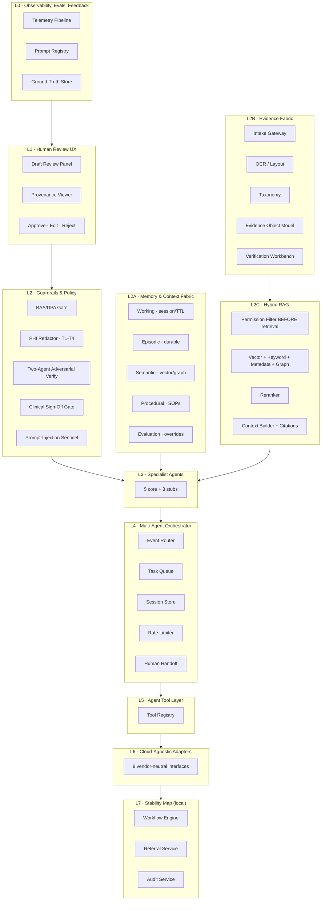
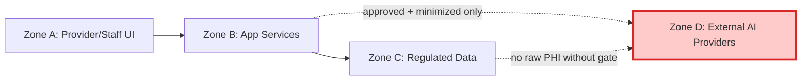

# Architecture

Full layered architecture reference for the SignalCare Agentic Demo. Mirrors the source-of-truth architecture at `C:\ClaudeAzure\docs\agentic-architecture-consolidated-cloud-agnostic.md`.

## Layered View

## L6 Adapter Contracts

Every external-platform dependency is a well-defined interface. The demo ships a local implementation of each; production would bind a different implementation at deployment time.

| Adapter | Local Implementation (this demo) | Interface File |
|---|---|---|
| Identity Provider | Keycloak (OIDC) | `app/L6_adapters/identity/base.py` |
| Compute Runtime | docker-compose | `app/L6_adapters/compute/base.py` |
| Relational Store | Postgres 16 + pgvector | `app/L6_adapters/relational/base.py` |
| Object Store | MinIO (S3-compatible) | `app/L6_adapters/object_store/base.py` |
| Event Bus | NATS JetStream | `app/L6_adapters/event_bus/base.py` |
| Secrets Vault | HashiCorp Vault (dev mode) | `app/L6_adapters/secrets/base.py` |
| Telemetry Sink | OpenTelemetry → LGTM stack | `app/L6_adapters/telemetry/base.py` |
| AI Model Gateway | Ollama (Fast tier) + OpenRouter (Reasoning + Balanced) | `app/L6_adapters/ai_gateway/base.py` |

## Model Tier Taxonomy (vendor-neutral)

| Tier | Local | API | Used By |
|---|---|---|---|
| Reasoning | Llama 3.3 70B (if GPU) | Claude Opus / GPT-5 via OpenRouter | Clinical Summary, Document Extraction, Packet Assembly |
| Balanced | Qwen 2.5 14B | Claude Sonnet via OpenRouter | Provider Intake, Reconciliation, Compliance/Ops digest |
| Fast | Llama 3.2 3B (CPU-fine) | Claude Haiku via OpenRouter | Completeness Checker, Eligibility Assist, Anomaly classification |

## Agent Catalog (5 core + 3 stubs for the demo)

| # | Agent | Model Tier | Ships in Demo | Trigger |
|---|---|---|---|---|
| 1 | Provider Intake Assistant | Balanced | **Full** | Portal new-referral |
| 2 | Completeness Checker | Fast | Stub | Submit intent |
| 3 | Document Extraction Agent | Reasoning | **Full** | Doc uploaded |
| 4 | Reconciliation Agent | Balanced | **Full** | Post-extraction |
| 5 | Eligibility Verification | Fast/Balanced | Stub | State = Eligibility |
| 6 | Clinical Summary Agent | Reasoning | **Full** | Screening/Triage/Review |
| 7 | Packet Assembly Agent | Reasoning | Stub | Ready for AHS |
| 8 | Compliance/Ops (Founder Mode) | Balanced+Fast | **Full · SHIPS FIRST** | Daily digest schedule |

## Trust Zones

In demo mode with fully synthetic data, no real PHI is ever in the system. The BAA gate still functions to prove the enforcement pattern.

## Cross-References

- [`C:\ClaudeAzure\docs\agentic-architecture-consolidated-cloud-agnostic.md`](file:///C:/ClaudeAzure/docs/agentic-architecture-consolidated-cloud-agnostic.md) — full architecture source of truth
- [`C:\ClaudeAzure\docs\agentic-architecture-consolidated-cloud-agnostic.docx`](file:///C:/ClaudeAzure/docs/agentic-architecture-consolidated-cloud-agnostic.docx) — Word companion
- [`docs/adrs/`](docs/adrs/) — Architecture Decision Records
- [`docs/build-plan.md`](docs/build-plan.md) — 8-week build plan
